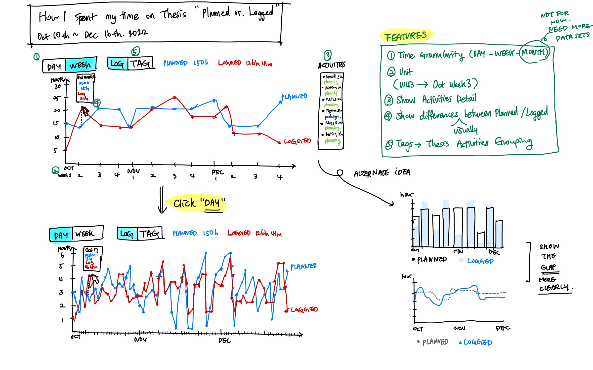
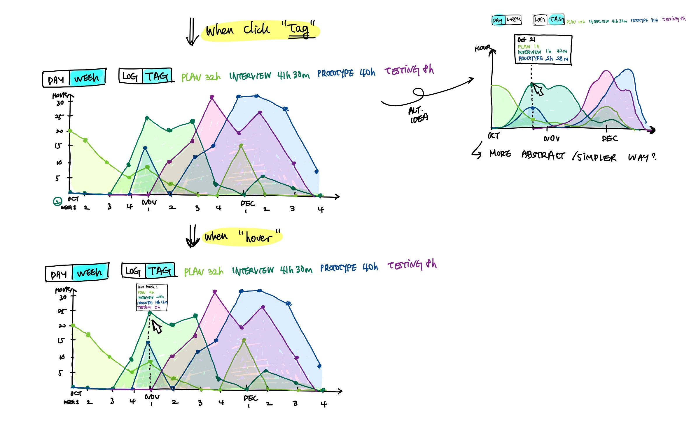

| [Homepage](https://yeonjin-park.github.io/portfolio/) | [Visualizing debt](/dataviz2.md) | [Critique by design](/dataviz3.md) | [Final Project 1](/final-1.md) | [Final Project 2](/final-2.md) | [Final Project 3](/final-3.md) |

# Critique by Design
In this page, I'll showcase a data visualization about `how I spent my time on the Thesis actually with a compared to my plan over 2 months`.  

## [🔗 A Link to the original data visualization](https://public.timelyapp.com/reports/CzCFGNvbGUuK1BuyejmyR6mJ) 
### **Why I chose this visualization?**
  For this assignment, I used my own datasets, which has recorded for around 2 months(Oct 10th - Dec 16th, 2022). To precisely record all my work processes and boost productivity regarding the thesis, I logged all my digital footprints on the desktop and phone related to the thesis by using `Timely service and their AI software`. Timely support a data visualization feature based on collected datasets, and I chose one of their charts design that shows `planned vs. logged datasets on the thesis project` since I felt there are some points that could be improved on for a better user experience. 

> Timely's timeline page, which is created based on collected user activity data (My personal page recorded on Oct 12th, 2022.)

### **Visualization(GIF)**
 Since the design I want to improve is not the public page I shared on the top, I attached the GIF that shows the private user page experience. 

  

## ⌛ Progress
### **Step 1. Insights I gained from the critique method**
  1) Which part stood out to me, and worked well? 
- Overall, the simple hierarchy and clear design of the visualization help users to recognize the trend of each planned and logged dataset without any confusion. 

  2) What it led me to think about when considering the redesign? 
- It doesn't present the datasets that can give meaningful insights to users, such as visually highlighting the gap between planned and logged. 
- The design only shows weekly datasets, not considering time granularity which covers detailed, daily information that the AI already tracked. 
- The unit used in the x-axis is not easily read by users (W47 -> Week 47 -> October Week 3).    

  3) Who's the primary audience of this tool, and is it effective?: 
- The primary audience of this tool is people who work most of their time using digital devices and also need to check work progress for their productivity and self-advocacy in the workplace. For example, the audience can be freelancers, project managers, remote workers, and consulting firms workers.
I guess this visualization is showing meaningful information, but it only provides really basic insights to users presenting the trend of weekly logged/planned datasets. To be more effective, it needs to highlight more in-depth insights that this dataset can create.

---
### **Step 2. Sketch Wireframe**
  While I critiqued the original visualization based on the given criteria(Stephen Few's Data Visualization Effectiveness Profile), I came up with some new ideas and drew the rough structure on my sticky note. The idea mainly focuses on `providing additional tabs(time/tags) to users` so that they can explore more meaningful datasets by themselves, not only `polishing visual details or revising unit issues`. 

> My first rough sketch for wireframe ideation

 
 
  Then I redrew the wireframes by using iPad, also considering the detailed layouts and interactions when user clicks each tab.

> My second iPad digital sketch 

---
### **Step 3. User Interview**
  1) User 1: Student, Late 20's
  Q1. Can you tell me what you think this is?
  A1. Yes. I noticed that this is about the work progress time log about the thesis since I read the title first. Also, the chart clearly shows what to deliver as it mainly consisted of two pieces of information - logged data and planned data. I can see a person usually worked less than a plan but sometimes more.

  Q2. Is there anything you find surprising or confusing? 
  A2. It’d be great if the visualization used transition animation when the user clicks between week and day since I thought the legibility of the day information is lower than the week because of the large number of data points. I also would like to suggest showing a pie chart of the activities (application usage, time stamps) besides the list.

  Q3. Who do you think is the intended audience for this?
  A3. Freelancers or students. It would be useful for people who have to control all the worktime by themselves and prove their work progress clearly to clients.

  Q4. Is there anything you would change or do differently?
  A4. It’d be nice if users could also see some meaningful information like patterns, lowest/highest, etc, so that they can extract insights to plan their future easily. Maybe this tool also can suggest to users some plans for the upcoming day/week/month.

  2) User 2: Student, Late 20's
- Need visual consistency between both line charts (Log/Tag options). I prefer filling out inside of the line chart like the original chart since it clearly shows the differences among different instances. 
- Showing detailed user activities on the right side can bring users information overload. Maybe need additional depth(user action) to get access to this information.
- If possible, providing an insight dashboard would be helpful so that users can easily grasp insights from this dataset. (e.g. You spent 57% of your total working time on the prototyping phase during 2 months.)
- Color usage: need to highlight the "logged" dataset more by giving more contrast on two line graphs. (e.g. use grey color for "planned" line graph).

---
### **Step 4. Build it!**
  First of all, I exported all the datasets into `.csv` from Timely so that I can use it for creating a visualization. I deleted some of the columns which will be not used for the design process. 

> (L)Original .csv file (R)Processed .csv file

  What I changed based on the user feedback: 
- Changed the color of each line graph to deliver a clear hierarchy between planned and logged datasets.
- Visual consistency: Filled out inside of the all different line charts.
- Created a on/off button for showing the user activities, which can reduce user's information overload. 
- Highlighted a pattern which can help user to find insights easier. 

## 📊 Final Design
### **How I spent my time on the Thesis actually with a compared to my plan over 2 months**

> A sample user experience with Figma prototype  

  I mainly used `Figma` to create a data visualization prototype since it can showcase as many details as possible I planned. You can check the overall user experience from the below Figma prototype. I also implemented `a simpler version of this idea by using Tableau`, with the actual datasets I extracted from Timely. 
- What my data visualization shows 
  It presents different depth of the information mainly based on time granularity and tags attached on each input. Also, it provides multiple options which users can utilitze as a tool to explore the visualidation that can lead them to proactively find meaningful insights for improving their productivity and building their future plans. 
- Why I selected the visualization 
  I decided to follow overall the same structure with the original design, a line chart, because that format will show the most detailed information but at the same time overall trends of each dataset. 

`↓ Figma Prototype: Please click any spaces so that you can explore the tool experience!`
<iframe style="border: 1px solid rgba(0, 0, 0, 0.1);" width="1200" height="800" src="https://www.figma.com/embed?embed_host=share&url=https%3A%2F%2Fwww.figma.com%2Fproto%2F3Qlj7vQAxTVcJwJWexFUCq%2FData-Visualization-Class%3Fpage-id%3D1%253A2%26node-id%3D18%253A9%26viewport%3D-1562%252C-95%252C0.5%26scaling%3Dcontain%26starting-point-node-id%3D18%253A9" allowfullscreen></iframe>

<noscript></noscript><object class='tableauViz'  style='display:none;'><param name='host_url' value='https%3A%2F%2Fpublic.tableau.com%2F' /> <param name='embed_code_version' value='3' /> <param name='site_root' value='' /><param name='name' value='FinalProjectThesisWorklog-3&#47;Dashboard1' /><param name='tabs' value='no' /><param name='toolbar' value='yes' /><param name='static_image' value='https:&#47;&#47;public.tableau.com&#47;static&#47;images&#47;Fi&#47;FinalProjectThesisWorklog-3&#47;Dashboard1&#47;1.png' /> <param name='animate_transition' value='yes' /><param name='display_static_image' value='yes' /><param name='display_spinner' value='yes' /><param name='display_overlay' value='yes' /><param name='display_count' value='yes' /><param name='language' value='en-US' /><param name='filter' value='publish=yes' /></object>
                

