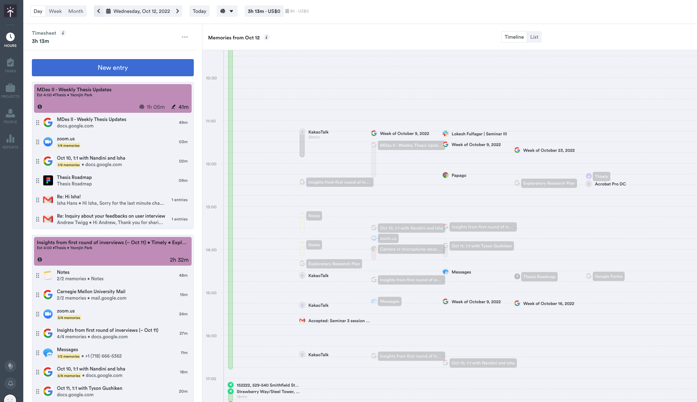
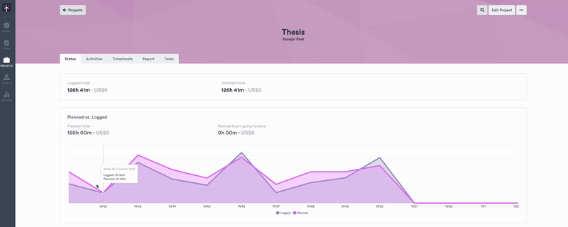
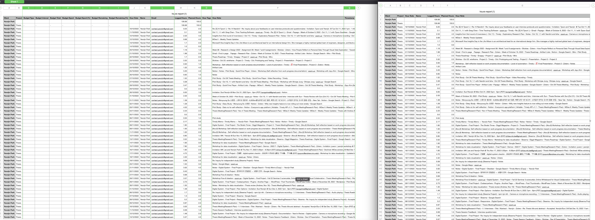

| [Homepage](https://yeonjin-park.github.io/portfolio/) | [Visualizing debt](/dataviz2.md) | [Critique by design](/dataviz3.md) |

# Critique by Design
In this page, I'll showcase a data visualization about `how I spent my time on the Thesis actually with a compared to my plan over 2 months`.  

## [🔗 A Link to the original data visualization](https://public.timelyapp.com/reports/LD7QYJYwrd6Ho1pPFvpRkP6Z) 
### **Why I chose this visualization?**
  For this assignment, I used my own datasets, which has recorded for around 2 months(Oct 10th - Dec 10th, 2022). To precisely record all my work processes and boost productivity regarding the thesis, I logged all my digital footprints on the desktop and phone related to the thesis by using `Timely service and their AI software`. Timely support a data visualization feature based on collected datasets, and I chose one of their charts design that shows `planned vs. logged datasets on the thesis project` since I felt there are some points that could be improved on for a better user experience. 

> Timely's timeline page, which is created based on collected user activity data (My personal page recorded on Oct 12th, 2022.)

### **Visualization(GIF)**
 Since the design I want to improve is not the public page I shared on the top, I attached the GIF that shows the private user page experience. 

## ⌛ Progress
### **Step 1. Insights I gained from the critique method**
  Which part stood out to me, and worked well? 
  What it led me to think about when considering the redesign? 

### **Step 2. Sketch Wireframe**
  Detailed info about the sketch 

> My first rough sketch for wireframe ideation

### **Step 3. User Interview**
  User 1. Student, Late 20's
  - Insights bullet point

  User 2. Student, Late 20's
  - Insights bullet point

### **Step 4. Build it!**
  First of all, I exported all the datasets into `.csv` from Timely so that I can use it for creating a visualization. I deleted some of the columns which will be not used for the design process. 

> (L)Original .csv file (R)Processed .csv file

  What I changed based on the user feedback 
  - Insights bullet point

## 📊 Final Design
### **How I spent my time on the Thesis actually with a compared to my plan over 2 months**
  About the final design 
  - What my data visualization shows 
  - Why I selected the visualization 
  - What I attempted to show differently 

<noscript></noscript><object class='tableauViz'  style='display:none;'><param name='host_url' value='https%3A%2F%2Fpublic.tableau.com%2F' /> <param name='embed_code_version' value='3' /> <param name='site_root' value='' /><param name='name' value='Thesisworklog&#47;Sheet3' /><param name='tabs' value='no' /><param name='toolbar' value='yes' /><param name='static_image' value='https:&#47;&#47;public.tableau.com&#47;static&#47;images&#47;Th&#47;Thesisworklog&#47;Sheet3&#47;1.png' /> <param name='animate_transition' value='yes' /><param name='display_static_image' value='yes' /><param name='display_spinner' value='yes' /><param name='display_overlay' value='yes' /><param name='display_count' value='yes' /><param name='language' value='ko-KR' /><param name='filter' value='publish=yes' /></object>
                

<iframe style="border: 1px solid rgba(0, 0, 0, 0.1);" width="1200" height="800" src="https://www.figma.com/embed?embed_host=share&url=https%3A%2F%2Fwww.figma.com%2Fproto%2FSGreJ6Rbd8Vw05YtMbbIku%2FTimely-Memo%3Fpage-id%3D31%253A7%26node-id%3D79%253A194%26viewport%3D231%252C244%252C0.09%26scaling%3Dcontain%26starting-point-node-id%3D79%253A194" allowfullscreen></iframe>
