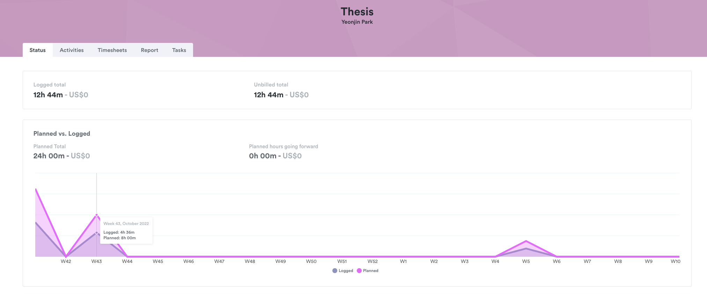

| [Homepage](https://yeonjin-park.github.io/portfolio/) | [Visualizing debt](/dataviz2.md) | [Critique by design](/dataviz3.md) |

# Critique by Design
Welcome! In this page, I'll showcase a data visualization about `how I spent my time on the Thesis actually with a compared to my plan over 2 months`.  

## [🔗 A Link to the original data visualization](https://public.timelyapp.com/reports/LD7QYJYwrd6Ho1pPFvpRkP6Z) 
### **Why I chose this visualization?**
  For this assignment, I used my own datasets which has recorded for around 2 months(Oct 10th - Dec 10th, 2022). To precisely record all my work process and boost a productivity regarding the thesis, I logged all my digital footprints on the desktop and phone related to the thesis by using `Timely service and their AI software`. Timely supports a data visualization feature based on collected datasets, and I chose one of their charts design that showing `planned vs. logged datasets on the thesis project`, since I felt there are some points that can be improved on for a better user experience. 

  `Video Recording`
 Since the design I want to improve is not the public page one, I attached the video that shows the private user page experience. 

## ⌛ Progress
### **Step 1. Insights I gained from the critique method**
  Which part stood out to me, and worked well? 
  What it led me to think about when considering the redesign? 

### **Step 2. Sketch Wireframe**
  Detailed info about the sketch 

> My first rough sketch for wireframe ideation

### **Step 3. User Interview**
  User 1. Student, Late 20's
  - Insights bullet point

  User 2. Student, Late 20's
  - Insights bullet point

### **Step 4. Build it!**
  What I changed based on the user feedback 
  - Insights bullet point

## 📊 Final Design
### **How I spent my time on the Thesis actually with a compared to my plan over 2 months**
  About the final design 
  - What my data visualization shows 
  - Why I selected the visualization 
  - What I attempted to show differently 

<iframe style="border: 1px solid rgba(0, 0, 0, 0.1);" width="1200" height="800" src="https://www.figma.com/embed?embed_host=share&url=https%3A%2F%2Fwww.figma.com%2Fproto%2FSGreJ6Rbd8Vw05YtMbbIku%2FTimely-Memo%3Fpage-id%3D31%253A7%26node-id%3D79%253A194%26viewport%3D231%252C244%252C0.09%26scaling%3Dcontain%26starting-point-node-id%3D79%253A194" allowfullscreen></iframe>
