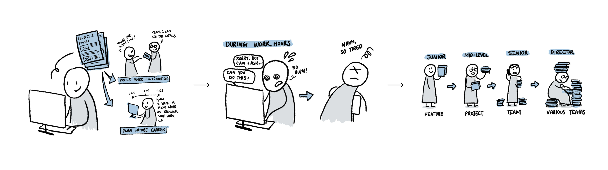
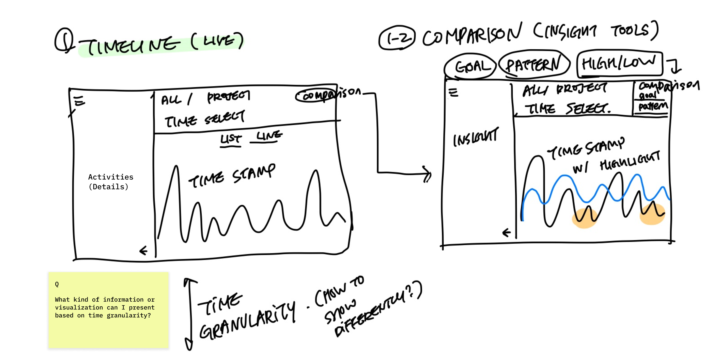
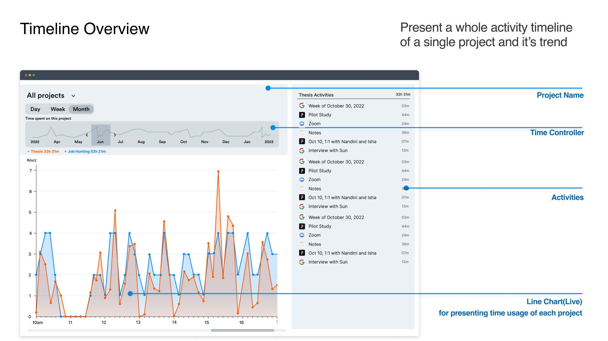
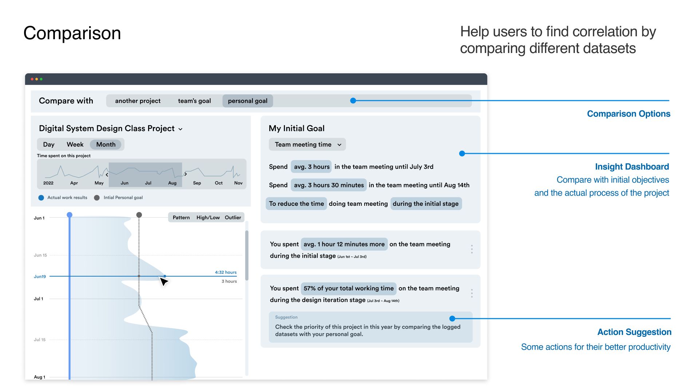

| [Homepage](https://yeonjin-park.github.io/portfolio/) | [Visualizing debt](/dataviz2.md) | [Critique by design](/dataviz3.md) | [Final Project 1](/final-1.md) |

# Outline
> Project Topic: Designing a visualization dashboard that helps users' time management or self-reflection on their work

For many working professionals(including students), consistently recording work activity can play an important role in `providing objective data to prove their work contributions` and can `provide a way to review current work and plan their future careers`. However, it is not easy to record daily tasks and reflections due to the lack of convenient processes to do so. Additionally, recording this activity can become burdensome if worker `responsibilities expand` as roles change, e.g., becoming a manager who needs to consider other people’s tasks rather than just their own.

Based on this context, I am exploring `how to visualize worklog information gathered via data-collecting technology`, and especially focusing on a `timeline overview and comparison chart` that can help peoples’ productivity. Finally, this approach may especially aid those who have difficulty actively advocating their work performance due to language and cultural barriers.

## Initial sketches
> My final project will be consisted of a timeline overview chart which also considers time granularity(Day/Week/Month) and a comparison feature that can give users more insights intuitively.

> Initial rough hand drawing of the idea

### Timeline Overview
- `Line Graph`: Presenting time usage of each project
- `Activities`: Showcase detailed user actiities of each project

### Comparison feature
- `Comparison Option`: Compare with another project or my initial goal
- `Check more details`: Highlight some patterns or highest/lowest points or outliers (e.g. patterns: A bigger gaps between planned vs. logged, especially on weekends)
- `Insight dashboard`: Show the written insights by comparing them with other datasets
- `Action Suggestion`: The dashboard suggest some actions to users for better productivity

# The data
I'm planning to use `my personal work log datasets` that I collected from the time-tracking software called [Timely](https://timelyapp.com/). Since I recorded all my work processes from last October, I will group some timestamp datasets within each project name(e.g. Thesis, Job Hunting, Digital Design System) and export all of those into csv. Recently, I worked on grouping my 2 months' activities related to my Thesis and I attached the related file below. I'll update the following other projects part whenever I finish those. 

> (L)Original .csv file (R)Processed .csv file

| Name | URL | Description |
|------|-----|-------------|
|   Thesis Worklog  |  [hours-report-final.numbers](https://github.com/yeonjin-park/portfolio/blob/295ed18e6aaaf0bd2593fd8631ef7eec06a72e7a/hours-report-final.numbers)   |      Processed .csv file of my thesis worklog       |
|   Job Hunting Worklog(TBD)   |     |             |
|   School Project Worklog(TBD)   |     |             |

# Method and medium
> FYI: I'm planning to actively use Figma to present the overall user experience of my visualization idea, then integrate with Tableau to implement some of the charts in that Prototype. I previously talked about this with professor Goranson.

- Data: Collecting `my personal worklog from Timely(Oct 2022~Jan 2023)` and export the datasets as .csv
- Overall prototype: Planning to use `Figma prototype` to showcase high-fidelity design of the dashboard and smooth overall user experience.
- Working prototype: Planning to use `Tableau` to implement one of my idea (e.g. Weekly or Monthly view of the timeline overview chart)
- Documentation: Figma prototype with Tableau Link  

